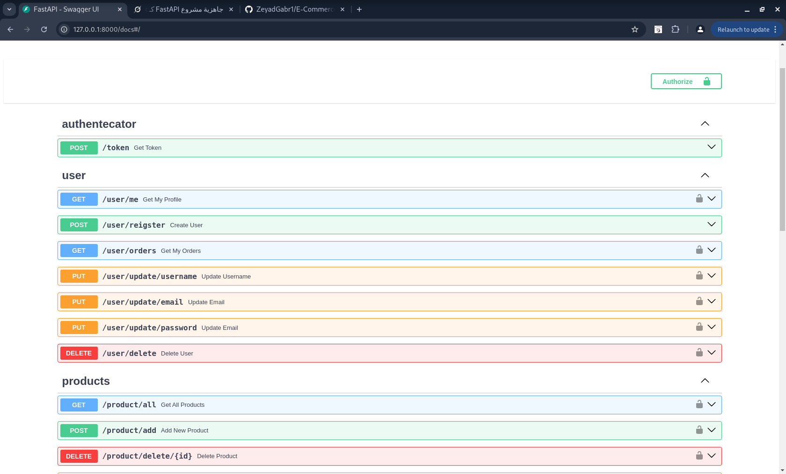
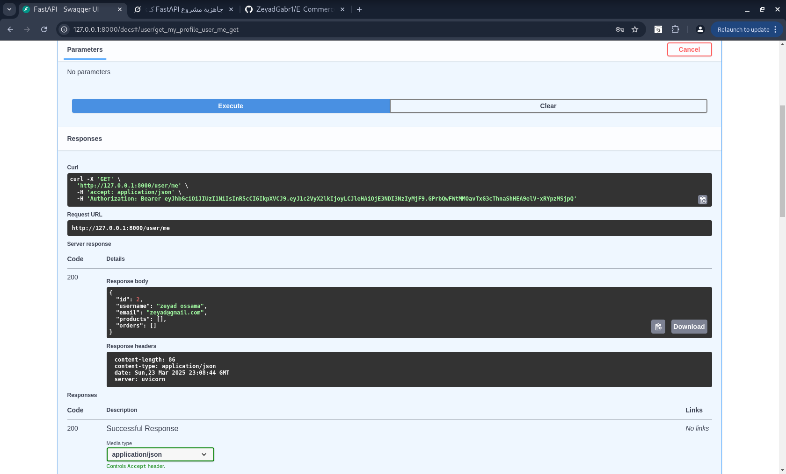

# E-Commerce API


A robust and scalable RESTful API built with **FastAPI**, designed for e-commerce functionalities. This project supports user management, product listings, and order processing, secured with JWT authentication and bcrypt password hashing. It offers flexible database options: MySQL for production-grade setups or SQLite for quick local testing.

---

## ✨ Features
- **User Management**: Register, login, update profile (username, email, password), and delete accounts.
- **Product Management**: Create, read, update, delete (CRUD), and search products by price/stock.
- **Order Management**: Place orders, view personal orders, manage order statuses (admin-only), and filter orders.
- **Authentication**: JWT-based with 15-minute token expiration for secure access (default secret provided).
- **Database Flexibility**: Supports MySQL (recommended) or SQLite (default for local use).
- **Input Validation**: Enforced via Pydantic models for data integrity.
- **Error Handling**: Comprehensive custom exceptions for clear feedback.

---

## 🛠️ Tech Stack
- **Framework**: FastAPI (Python)
- **Database**: MySQL (production-ready) or SQLite (local testing)
- **ORM**: SQLAlchemy for efficient database operations
- **Security**: JWT (JSON Web Tokens), Passlib (bcrypt)
- **Environment**: Managed with python-dotenv

---

## 🚀 Getting Started

### Prerequisites
- **Required**: Python 3.8+, Git
- **Optional**: MySQL Server (for MySQL usage)

### Installation
1. **Clone the Repository**:
   ```bash
   git clone https://github.com/ZeyadGabr1/E-Commerce-Api.git
   cd E-Commerce-Api
   ```
2. **Install Dependencies**:
   ```bash
   pip install -r requirements.txt
   ```

### Configuration
The API works out of the box with default settings, but you can customize it based on your needs.

#### Database Options
- **SQLite (Default - No Setup Required)**
  - If no `.env` file is provided or MySQL credentials are missing, the API uses a local SQLite database (`data.db`) automatically.
  - Ideal for quick testing or development—no additional setup needed!

- **MySQL (Recommended for Production)**
  - Install MySQL ([Download MySQL](https://www.mysql.com/downloads/)).
  - Create a database (e.g., `e_commerce_api`):
    ```sql
    CREATE DATABASE e_commerce_api;
    ```
  - Add MySQL credentials to a `.env` file (see below).

#### Environment Variables (`.env`)
To customize settings, create a `.env` file in the project root:
   ```plaintext
   DB_USERNAME=your-mysql-username
   DB_PASSWORD=your-mysql-password
   DB_SERVER_URL=localhost
   DB_NAME=e_commerce_api
   JWT_SECRET=your-unique-secret-key
   JWT_ALGORITHM=HS256
   ```
**Notes:**
- Replace `your-mysql-username` and `your-mysql-password` with your MySQL credentials.
- Use a strong `JWT_SECRET` (e.g., a 32-character random string) for security.
- If `.env` is omitted, the API uses SQLite and a default JWT secret.

### Run the Application
   ```bash
   uvicorn main:app --reload
   ```
Access the API at [http://127.0.0.1:8000/docs](http://127.0.0.1:8000/docs) for the interactive Swagger UI.

---

## 📋 API Endpoints

### Authentication
| Endpoint | Method | Description | Authentication |
|----------|--------|-------------|---------------|
| `/token` | POST | Login and get access token | No |

### User Routes
| Endpoint | Method | Description | Authentication |
|----------|--------|-------------|---------------|
| `/user/register` | POST | Register a new user | No |
| `/user/me` | GET | Get current user profile | Yes |
| `/user/orders` | GET | Get user's orders | Yes |
| `/user/update/username` | PUT | Update username | Yes |
| `/user/update/email` | PUT | Update email | Yes |
| `/user/update/password` | PUT | Update password | Yes |
| `/user/delete` | DELETE | Delete user account | Yes |

### Product Routes
| Endpoint | Method | Description | Authentication |
|----------|--------|-------------|---------------|
| `/product/all` | GET | List all available products | Yes |
| `/product/add` | POST | Add a new product | Yes |
| `/product/delete/{id}` | DELETE | Delete a product by ID | Yes |
| `/product/edit/{id}` | PUT | Edit a product by ID | Yes |
| `/product/search` | GET | Search products by price/stock | Yes |

### Order Routes
| Endpoint | Method | Description | Authentication |
|----------|--------|-------------|---------------|
| `/order/my` | GET | Get user's orders | Yes |
| `/order/create` | POST | Place a new order | Yes |
| `/order/update/status/{id}` | PUT | Update order status (Admin) | Yes |
| `/order/all` | GET | Get all orders (Admin) | Yes |
| `/order/search` | GET | Search orders by status (Admin) | Yes |

Explore all endpoints via Swagger UI at `/docs`.

---

## 📷 Screenshots
### Swagger UI


### Example Response


---

## 🤝 Contributing
1. Fork the repository.
2. Create a new branch:
   ```bash
   git checkout -b feature/your-feature
   ```
3. Commit your changes:
   ```bash
   git commit -m "Add your feature"
   ```
4. Push to the branch:
   ```bash
   git push origin feature/your-feature
   ```
5. Open a Pull Request.

---

## 📧 Contact
- **Email**: zeyad.gabr12222009@gmail.com
- **GitHub**: https://github.com/ZeyadGabr1

---

## 📜 License
This project is licensed under the MIT License - see the `LICENSE` file for details.
